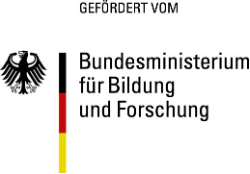

<!-- Title page definition -->
\newpage

::: {custom-style="TitlepageHeadingBold"}
Abschlussbericht für das Projekt
:::
::: {custom-style="Project"}
 {{project}}
:::

::: {custom-style="Title"}
{{title}}
:::

::: {custom-style="TitlepageHeadingPlain"}
Teilprojekt KIT (IAM-ESS)
:::
::: {custom-style="Subtitle"}
{{subtitle}}
:::

::: {custom-style="TitlepageText"}
Förderkennzeichen: {{foerderkennzeichen}}

Förderzeitraum: {{foerderzeitraum}}\
(inkl. 9-monatige kostenneutrale Verlängerung)
:::

::: {custom-style="TitlepageHeadingSmall"}
Autoren:
:::
::: {custom-style="Author"}
{{author}}
:::

::: {custom-style="TitlepageText"}
_Die Verantortung für den Inhalt der Veröffentlichung liegt bei den Autoren_
:::

::: {custom-style="TitlepageHeadingSmall"}
Zuwendungsempfänger:
:::
::: {custom-style="Address"}
{{affiliation}}
:::

::: {custom-style="Date"}

{{date}}
:::

\newpage

<!-- End of title page definition -->
# Einleitung

## Aufgabenstellung

##### Ziele im Verbund

Lorem ipsum dolor sit amet, consetetur sadipscing elitr, sed diam nonumy eirmod tempor invidunt ut labore et dolore magna aliquyam erat, sed diam voluptua. At vero eos et accusam et justo duo dolores et ea rebum. Stet clita kasd gubergren, no sea takimata sanctus est Lorem ipsum dolor sit amet. Lorem ipsum dolor sit amet, consetetur sadipscing elitr, sed diam nonumy eirmod tempor invidunt ut labore et dolore magna aliquyam erat, sed diam voluptua. At vero eos et accusam et justo duo dolores et ea rebum. Stet clita kasd gubergren, no sea takimata sanctus est Lorem ipsum dolor sit amet. Lorem ipsum dolor sit amet, consetetur sadipscing elitr, sed diam nonumy eirmod tempor invidunt ut labore et dolore magna aliquyam erat, sed diam voluptua. At vero eos et accusam et justo duo dolores et ea rebum. Stet clita kasd gubergren, no sea takimata sanctus est Lorem ipsum dolor sit amet.   

**Duis autem vel eum iriure dolor in hendrerit in vulputate velit esse molestie consequat, vel illum dolore eu feugiat nulla facilisis at vero eros et accumsan et iusto odio dignissim qui blandit praesent luptatum zzril delenit augue duis dolore te feugait nulla facilisi.** Lorem ipsum dolor sit amet, consectetuer adipiscing elit, sed diam nonummy nibh euismod tincidunt ut laoreet dolore magna aliquam erat volutpat.   

Ut wisi enim ad minim veniam, quis nostrud exerci tation ullamcorper suscipit lobortis nisl ut aliquip ex ea commodo consequat. Duis autem vel eum iriure dolor in hendrerit in vulputate velit esse

##### Teilziele des XXX

Lorem ipsum dolor sit amet, consetetur sadipscing elitr, sed diam nonumy eirmod tempor invidunt ut labore et dolore magna aliquyam erat, sed diam voluptua. At vero eos et accusam et justo duo dolores et ea rebum. Stet clita kasd gubergren, no sea takimata sanctus est Lorem ipsum dolor sit amet. Lorem ipsum dolor sit amet, consetetur sadipscing elitr, sed diam nonumy eirmod tempor invidunt ut labore et dolore magna aliquyam erat, sed diam voluptua. At vero eos et accusam et justo duo dolores et ea rebum. Stet clita kasd gubergren, no sea takimata sanctus est Lorem ipsum dolor sit amet. Lorem ipsum dolor sit amet, consetetur sadipscing elitr, sed diam nonumy eirmod tempor invidunt ut labore et dolore magna aliquyam erat, sed diam voluptua. At vero eos et accusam et justo duo dolores et ea rebum. Stet clita kasd gubergren, no sea takimata sanctus est Lorem ipsum dolor sit amet.   

## Beitrag der Ergebnisse zu den förderpolitischen Zielen

Lorem ipsum dolor sit amet, consetetur sadipscing elitr, sed diam nonumy eirmod tempor invidunt ut labore et dolore magna aliquyam erat, sed diam voluptua. At vero eos et accusam et justo duo dolores et ea rebum. Stet clita kasd gubergren, no sea takimata sanctus est Lorem ipsum dolor sit amet. Lorem ipsum dolor sit amet, consetetur sadipscing elitr, sed diam nonumy eirmod tempor invidunt ut labore et dolore magna aliquyam erat, sed diam voluptua. At vero eos et accusam et justo duo dolores et ea rebum. Stet clita kasd gubergren, no sea takimata sanctus est Lorem ipsum dolor sit amet.

## Voraussetzungen

**Die Antragsteller sind komplementär aufgestellt und nutzten ihre Expertise in ....... (Partner 1), ....... (Partner 2), ....... (Partner 3) sowie ..... (Partner 4) sehr erfolgreich, um ..... zu etablieren.**

*Abschnitt zur eigenen für das Projekt relevanten Expertise.* Lorem ipsum dolor sit amet, consetetur sadipscing elitr, sed diam nonumy eirmod tempor invidunt ut labore et dolore magna aliquyam erat, sed diam voluptua. At vero eos et accusam et justo duo dolores et ea rebum. Stet clita kasd gubergren, no sea takimata sanctus est Lorem ipsum dolor sit amet. Lorem ipsum dolor sit amet, consetetur sadipscing elitr, sed diam nonumy eirmod tempor invidunt ut labore et dolore magna aliquyam erat, sed diam voluptua. At vero eos et accusam et justo duo dolores et ea rebum. Stet clita kasd gubergren, no sea takimata sanctus est Lorem ipsum dolor sit amet. Lorem ipsum dolor sit amet, consetetur sadipscing elitr, sed diam nonumy eirmod tempor invidunt ut labore et dolore magna aliquyam erat, sed diam voluptua. At vero eos et accusam et justo duo dolores et ea rebum. Stet clita kasd gubergren, no sea takimata sanctus est Lorem ipsum dolor sit amet. 

## Planung und Ablauf des Vorhabens

Lorem ipsum dolor sit amet, consetetur sadipscing elitr, sed diam nonumy eirmod tempor invidunt ut labore et dolore magna aliquyam erat, sed diam voluptua. At vero eos et accusam et justo duo dolores et ea rebum. Stet clita kasd gubergren, no sea takimata sanctus est Lorem ipsum dolor sit amet. Lorem ipsum dolor sit amet, consetetur sadipscing elitr, sed diam nonumy eirmod tempor invidunt ut labore et dolore magna aliquyam erat, sed diam voluptua. At vero eos et accusam et justo duo dolores et ea rebum. Stet clita kasd gubergren, no sea takimata sanctus est Lorem ipsum dolor sit amet. Lorem ipsum dolor sit amet, consetetur sadipscing elitr, sed diam nonumy eirmod tempor invidunt ut labore et dolore magna aliquyam erat, sed diam voluptua. At vero eos et accusam et justo duo dolores et ea rebum. Stet clita kasd gubergren, no sea takimata sanctus est Lorem ipsum dolor sit amet.   

Duis autem vel eum iriure dolor in hendrerit in vulputate velit esse molestie consequat, vel illum dolore eu feugiat nulla facilisis at vero eros et accumsan et iusto odio dignissim qui blandit praesent luptatum zzril delenit augue duis dolore te feugait nulla facilisi. Lorem ipsum dolor sit amet,

Das Vorhaben gliederte sich in die folgenden Arbeitspakete:

| AP X.1: Titel des Arbeitspaketes |
| ---- |
| 1. Arbeitspunkt oder Ziel 2. ... 3. ... |

| AP X.2: Titel des Arbeitspaketes |
| ---- |
| 1. Arbeitspunkt oder Ziel 2. ... 3. ... |

| AP X.3: Titel des Arbeitspaketes |
| ---- |
| 1. Arbeitspunkt oder Ziel 2. ... 3. ... |

# Grundlagen

## Stand der Technik und der Wissenschaft

Lorem ipsum dolor sit amet, consetetur sadipscing elitr, sed diam nonumy eirmod tempor invidunt ut labore et dolore magna aliquyam erat, sed diam voluptua. At vero eos et accusam et justo duo dolores et ea rebum. Stet clita kasd gubergren, no sea takimata sanctus est Lorem ipsum dolor sit amet. Lorem ipsum dolor sit amet, consetetur sadipscing elitr, sed diam nonumy eirmod tempor invidunt ut labore et dolore magna aliquyam erat, sed diam voluptua. At vero eos et accusam et justo duo dolores et ea rebum. Stet clita kasd gubergren, no sea takimata sanctus est Lorem ipsum dolor sit amet. Lorem ipsum dolor sit amet, consetetur sadipscing elitr, sed diam nonumy eirmod tempor invidunt ut labore et dolore magna aliquyam erat, sed diam voluptua. At vero eos et accusam et justo duo dolores et ea rebum. Stet clita kasd gubergren, no sea takimata sanctus est Lorem ipsum dolor sit amet.   

Duis autem vel eum iriure dolor in hendrerit in vulputate velit esse molestie consequat, vel illum dolore eu feugiat nulla facilisis at vero eros et accumsan et iusto odio dignissim qui blandit praesent luptatum zzril delenit augue duis dolore te feugait nulla facilisi. Lorem ipsum dolor sit amet, consectetuer adipiscing elit, sed diam nonummy nibh euismod tincidunt ut laoreet dolore magna aliquam erat volutpat.   

Ut wisi enim ad minim veniam, quis nostrud exerci tation ullamcorper suscipit lobortis nisl ut aliquip ex ea commodo consequat. Duis autem vel eum iriure dolor in hendrerit in vulputate velit esse molestie consequat, vel illum dolore eu feugiat nulla facilisis at vero eros et accumsan et iusto odio dignissim qui blandit praesent luptatum zzril delenit augue duis dolore te feugait nulla facilisi.   

{#fig:figure_label1 width=14cm}

<!-- **Abbildung 2.1:** Darstellung dreier grundlegender graphitischer Oberflächenstrukturen, die üblicherweise zur Beschreibung der Elektrokatalyse in Vanadium-Flow-Batterien verwendet werden, und typischer Charakterisierungsinstrumente, die zu ihrer Analyse eingesetzt werden. (a) Graphen-ähnliche Elektroden, charakterisiert durch Raman-Spektroskopie und positive Halbzellen-CV. (b) Graphenoxid-ähnliche Elektroden, abgebildet durch SEM und untersucht durch XPS. (c) Reduzierte graphenoxidähnliche Elektroden, die mittels XRD, Raman-Spektroskopie und positivem Halbzellen-CV untersucht wurden. -->

Nam liber tempor cum soluta nobis eleifend option congue nihil imperdiet doming id quod mazim placerat facer possim assum. Lorem ipsum dolor sit amet, consectetuer adipiscing elit, sed diam nonummy nibh euismod tincidunt ut laoreet dolore magna aliquam erat volutpat. Ut wisi enim ad minim veniam, quis nostrud exerci tation ullamcorper suscipit lobortis nisl ut aliquip ex ea commodo consequat.   

Duis autem vel eum iriure dolor in hendrerit in vulputate velit esse molestie consequat, vel illum dolore eu feugiat nulla facilisis.   

At vero eos et accusam et justo duo dolores et ea rebum. Stet clita kasd gubergren, no sea takimata sanctus est Lorem ipsum dolor sit amet. Lorem ipsum dolor sit amet, consetetur

# Ziele und Ergebnisse

## AP X.1: Titel des Arbeitspaketes

Lorem ipsum dolor sit amet, consetetur sadipscing elitr, sed diam nonumy eirmod tempor invidunt ut labore et dolore magna aliquyam erat, sed diam voluptua. At vero eos et accusam et justo duo dolores et ea rebum. Stet clita kasd gubergren, no sea takimata sanctus est Lorem ipsum dolor sit amet. Lorem ipsum dolor sit amet, consetetur sadipscing elitr, sed diam nonumy eirmod tempor invidunt ut labore et dolore magna aliquyam erat, sed diam voluptua. At vero eos et accusam et justo duo dolores et ea rebum. Stet clita kasd gubergren, no sea takimata sanctus est Lorem ipsum dolor sit amet. Lorem ipsum dolor sit amet, consetetur sadipscing elitr, sed diam nonumy eirmod tempor invidunt ut labore et dolore magna aliquyam erat, sed diam voluptua. At vero eos et accusam et justo duo dolores et ea rebum. Stet clita kasd gubergren, no sea takimata sanctus est Lorem ipsum dolor sit amet.   

Duis autem vel eum iriure dolor in hendrerit in vulputate velit esse molestie consequat, vel illum dolore eu feugiat nulla facilisis at vero eros et accumsan et iusto odio dignissim qui blandit praesent luptatum zzril delenit augue duis dolore te feugait nulla facilisi. Lorem ipsum dolor sit amet, consectetuer adipiscing elit, sed diam nonummy nibh euismod tincidunt ut laoreet dolore magna aliquam erat volutpat.  

{#fig:figure_label2 width=14cm}

<!-- **Abbildung 3.1:** CAD-Zeichnungen der entwickelten Testzellen zur Testung von Graphitvlies-Elektroden und Bipolarplatten. (a) Aufbau zur in-situ-Messung von elektrischer Leitfähigkeit unter angelegter Kompression, (b) drei-Elektroden-Zelle zur elektrochemischen Halbzell-Charakterisierung von Vlieselektroden und Messung der Korrosionsbeständigkeit von Bipolarplatten, und (c) Nachzeichnung einer bestehenden Redox-Flow-Vollzellgeometrie mit austauschbaren Komponenten für den flow-through und flow-by Betrieb. -->

Ut wisi enim ad minim veniam, quis nostrud exerci tation ullamcorper suscipit lobortis nisl ut aliquip ex ea commodo consequat. Duis autem vel eum iriure dolor in hendrerit in vulputate velit esse molestie consequat, vel illum dolore eu feugiat nulla facilisis at vero eros et accumsan et iusto odio dignissim qui blandit praesent luptatum zzril delenit augue duis dolore te feugait nulla facilisi.   

Nam liber tempor cum soluta nobis eleifend option congue nihil imperdiet doming id quod mazim placerat facer possim assum. Lorem ipsum dolor sit amet, consectetuer adipiscing elit, sed diam nonummy nibh euismod tincidunt ut laoreet dolore magna aliquam erat volutpat. Ut wisi enim ad minim veniam, quis nostrud exerci tation ullamcorper suscipit lobortis nisl ut aliquip ex ea commodo consequat.   

Duis autem vel eum iriure dolor in hendrerit in vulputate velit esse molestie consequat, vel illum dolore eu feugiat nulla facilisis.   

## AP X.2: Titel des Arbeitspaketes

At vero eos et accusam et justo duo dolores et ea rebum. Stet clita kasd gubergren, no sea takimata sanctus est Lorem ipsum dolor sit amet. Lorem ipsum dolor sit amet, consetetur sadipscing elitr, sed diam nonumy eirmod tempor invidunt ut labore et dolore magna aliquyam erat, sed diam voluptua. At vero eos et accusam et justo duo dolores et ea rebum. Stet clita kasd gubergren, no sea takimata sanctus est Lorem ipsum dolor sit amet. Lorem ipsum dolor sit amet, consetetur sadipscing elitr, At accusam aliquyam diam diam dolore dolores duo eirmod eos erat, et nonumy sed tempor et et invidunt justo labore Stet clita ea et gubergren, kasd magna no rebum. sanctus sea sed takimata ut vero voluptua. est Lorem ipsum dolor sit amet. Lorem ipsum dolor sit amet, consetetur sadipscing elitr, sed diam nonumy eirmod tempor invidunt ut labore et dolore magna aliquyam erat.   

Consetetur sadipscing elitr, sed diam nonumy eirmod tempor invidunt ut labore et dolore magna aliquyam erat, sed diam voluptua. At vero eos et accusam et justo duo dolores et ea rebum. Stet clita kasd gubergren, no sea takimata sanctus est Lorem ipsum dolor sit amet. Lorem ipsum dolor sit amet, consetetur sadipscing elitr, sed diam nonumy eirmod tempor invidunt ut labore et dolore magna aliquyam erat, sed diam voluptua. At vero eos et accusam et justo duo dolores et ea rebum. Stet clita kasd gubergren, no sea takimata sanctus est Lorem ipsum dolor sit amet. Lorem ipsum dolor sit amet, consetetur sadipscing elitr, sed diam nonumy eirmod tempor invidunt ut labore et dolore magna aliquyam erat, sed diam voluptua. At vero eos et accusam et justo duo dolores et ea rebum. Stet clita kasd gubergren, no sea takimata sanctus.   

Lorem ipsum dolor sit amet, consetetur sadipscing elitr, sed diam nonumy eirmod tempor invidunt ut labore et dolore magna aliquyam erat, sed diam voluptua. At vero eos et accusam et justo duo dolores et ea rebum. Stet clita kasd gubergren, no sea takimata sanctus est Lorem ipsum dolor sit amet. Lorem ipsum dolor sit amet, consetetur sadipscing elitr, sed diam nonumy eirmod tempor invidunt ut labore et dolore magna aliquyam erat, sed diam voluptua. At vero eos et accusam et justo duo dolores et ea rebum. Stet clita kasd gubergren, no sea takimata sanctus est Lorem ipsum dolor sit amet. Lorem ipsum dolor sit amet, consetetur sadipscing elitr, sed diam nonumy eirmod tempor invidunt ut labore et dolore magna aliquyam erat, sed diam voluptua. At vero eos et accusam et justo duo dolores et ea rebum. Stet clita kasd gubergren, no sea 

# Wichtigste Positionen des zahlenmäßigen Nachweises

Im Rahmen des Projektes wurden am KIT Ausgaben in Höhe von **xxx Euro** getätigt.

Davon entfielen folgende Aufwendungen für:

| Position  | Betrag  |
|---|---:|
|0812 Beschäftigte E12-E15|xxx € |
|0822 Beschäftigte (sonst. Beschäf.-Entgelte)|xxx € |
|0843 Sonst. Allg. Verw.-Ausg.|xxx € |
|0846 Dienstreisen|xxx € |
|0850 Gegenstände über 410 €|xxx € |
|**Summe**|**xxx €** |

# Notwendigkeit und Angemessenheit der Arbeit

Das XXXXXX-Verbundvorhaben adressiert die Ziele zur “XXXXXXXXXX“. Ein erklärtes Ziel hierbei ist es, .....

# Voraussichtlicher Nutzen, insbesondere der Verwertbarkeit der Ergebnisse im Sinne des fortgeschriebenen Verwertungsplans

Lorem ipsum dolor sit amet, consetetur sadipscing elitr, sed diam nonumy eirmod tempor invidunt ut labore et dolore magna aliquyam erat, sed diam voluptua. At vero eos et accusam et justo duo dolores et ea rebum. Stet clita kasd gubergren, no sea takimata sanctus est Lorem ipsum dolor sit amet. Lorem ipsum dolor sit amet, consetetur sadipscing elitr, sed diam nonumy eirmod tempor invidunt ut labore et dolore magna aliquyam erat, sed diam voluptua. At vero eos et accusam et justo duo dolores et ea rebum. Stet clita kasd gubergren, no sea takimata sanctus est Lorem ipsum dolor sit amet. Lorem ipsum dolor sit amet, consetetur sadipscing elitr, sed diam nonumy eirmod tempor invidunt ut labore et dolore magna aliquyam erat, sed diam voluptua. At vero eos et accusam et justo duo dolores et ea rebum. Stet clita kasd gubergren, no sea 

# Während der Durchführung des Vorhabens dem ZE bekannt gewordene Fortschritte auf dem Gebiet des Vorhabens bei anderen Stellen

Dem KIT sind während der Durchführung des Vorhabens keine wesentlichen Fortschritte bei anderen Stellen bekannt geworden, die hier berücksichtigt hätten werden müssen. Aktuelle Erkenntniss auf dem Arbeitsgebiet am KIT wurden Konferenzen präsentiert und aktuelle Entwicklungen jeweils zeitnah in den APs berücksichtigt.

# Erfolgte oder geplante Veröffentlichung des Ergebnisses nach Nr. 11

## Publikationen in wissenschaftlichen Fachzeitschriften

1.  ...
2.  ...

## Artikel in Konferenzbüchern

1.  ...
2.  ...

## Vorträge auf Konferenzen

1.  ...
2.  ...

## Poster auf Konferenzen

1.  ...
2.  ...

## Betreute Qualifizierungsarbeiten

1.  ...
2.  ...

# Abbildungsverzeichnis

\listoffigures

# Tabellenverzeichnis

\listoftables

# Quellenverzeichnis

::: {#refs}
:::

