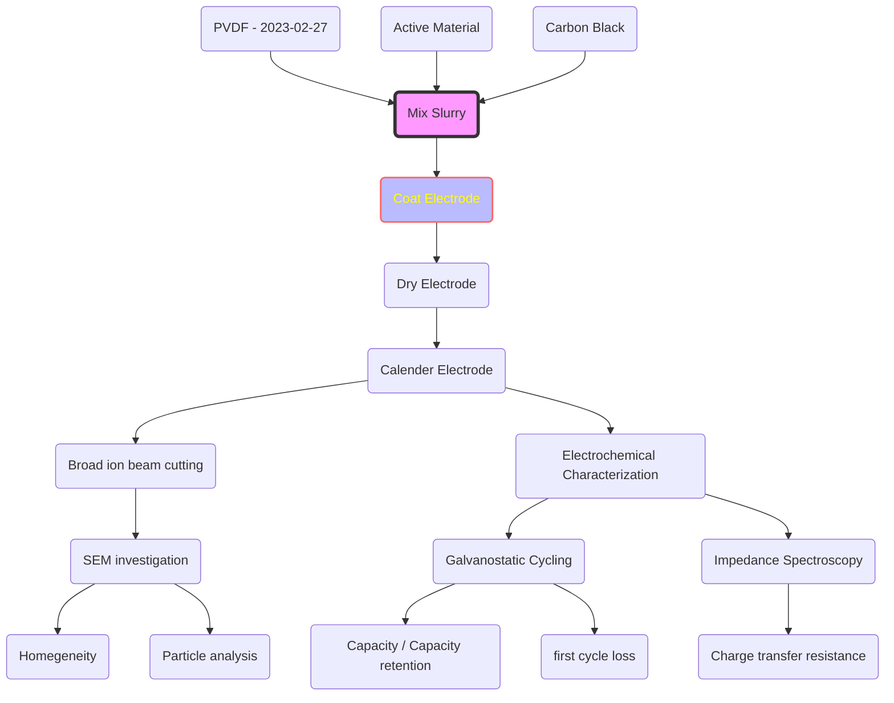

```mermaid
flowchart TD
    bin(PVDF - 2023-02-27)
    ac(Active Material)
    cb(Carbon Black)
    mix(Mix Slurry)
    coat(Coat Electrode)
    dry(Dry Electrode)
    cal(Calender Electrode)
    bic(Broad ion beam cutting)
    sem(SEM investigation)
    ec(Electrochemical Characterization)
    gcpl(Galvanostatic Cycling)
    eis(Impedance Spectroscopy)
    %% xrd(X-ray diffraction)
    %% ram(Raman)
    rct(Charge transfer resistance)
    cap(Capacity / Capacity retention)
    fcl(first cycle loss)
    hom(Homegeneity)
    part(Particle analysis)

	bin & ac & cb --> mix --> coat --> dry --> cal
    cal --> bic & ec
    bic --> sem --> hom & part
    ec --> gcpl & eis
    eis --> rct
    gcpl --> cap & fcl
    
    style mix fill:#f9f,stroke:#333,stroke-width:4px
    style coat fill:#bbf,stroke:#f66,stroke-width:2px,color:#ff0
    class bin,ac,cb internal-link;
```
