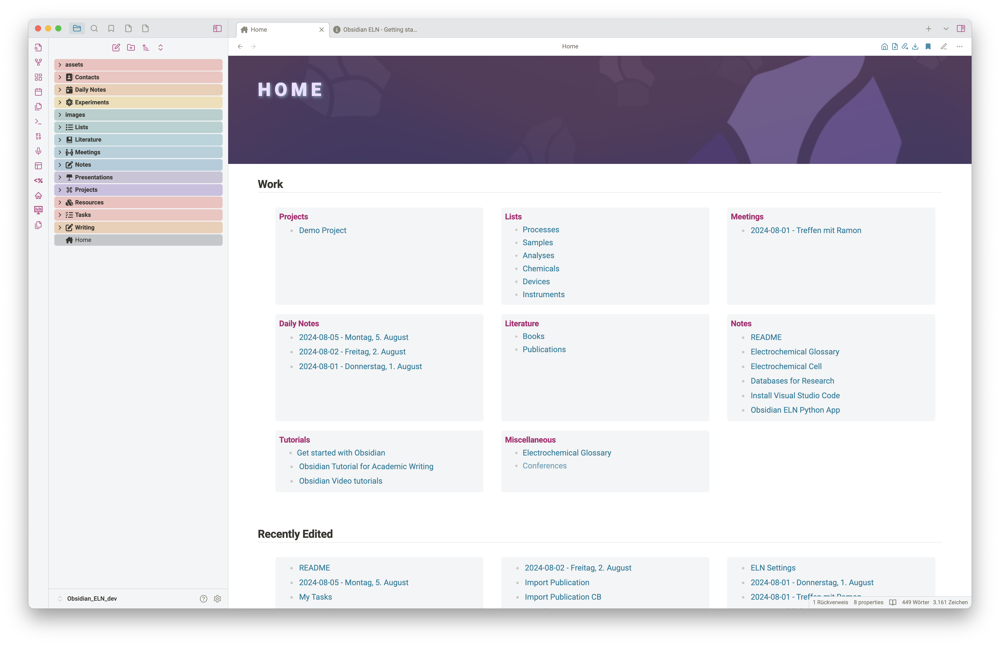
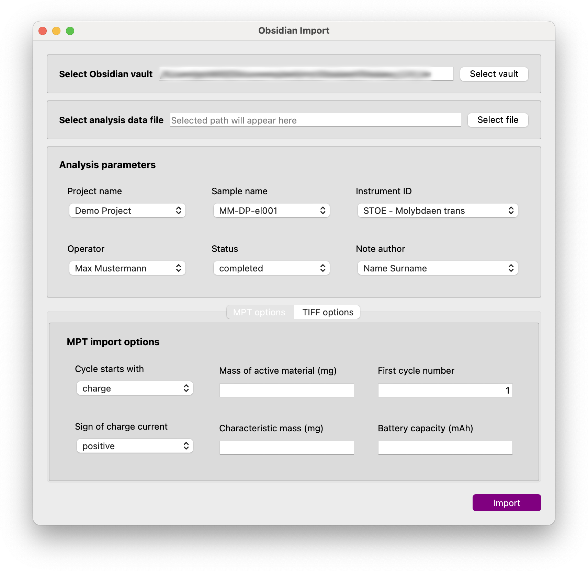
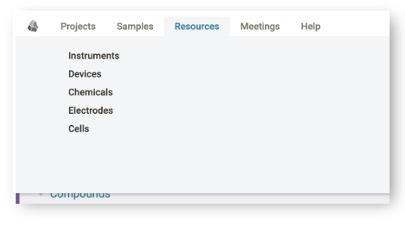
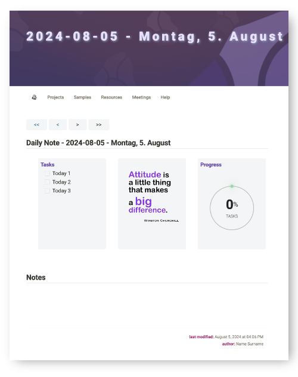
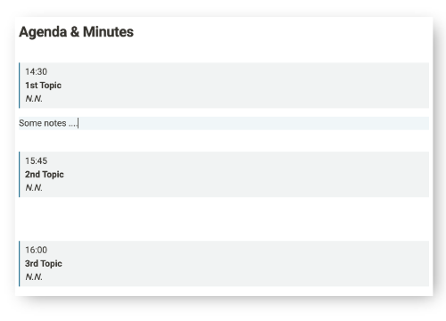
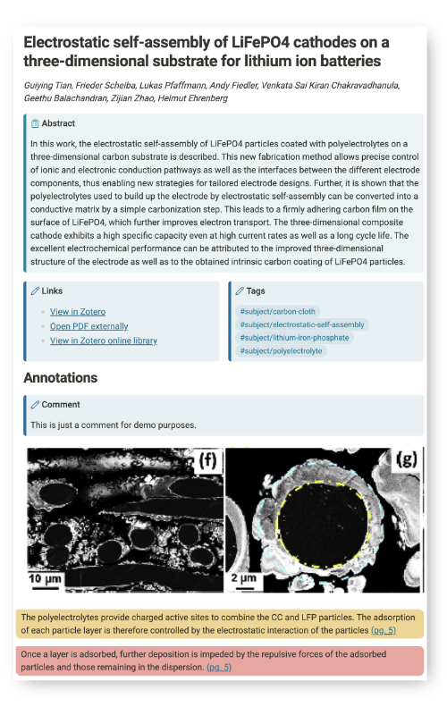
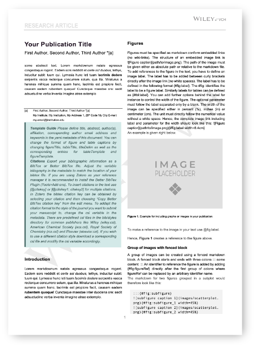

# Obsidian ELN

Welcome to Obsidian ELN, an electronic lab notebook integrated directly into the [Obsidian](https://obsidian.md) note-taking app. It is designed to help researchers document and organize their research data.

Obsidian ELN provides a framework of smart templates that help you collect information about your experiments and organize them in an efficient way, making it easy and pleasant to work with. It has a modular design to minimize the effort of entering metadata such as experiment parameters.

Thanks to the Dataview plugin, different note types provide dynamically updated lists and tables to access and visualize your ELN notes. Sample notes, for example, have Dataview table views that display specific metadata parameters for all analyses added for that particular sample.

However, Obsidian ELN goes far beyond a simple ELN. Thanks to the power of Obsidian's rich base of community plugins, it offers the import of literature notes via [Zotero Integration](https://github.com/mgmeyers/obsidian-zotero-integration) and thanks to the [Enhancing Export](https://github.com/mokeyish/obsidian-enhancing-export) plugin and [Pandoc](https://pandoc.org) you can write manuscripts or reports directly in Obsidian and export them as well-formatted Word files or convert them to LaTeX and many other file formats. 

Additional templates help you collect meeting notes, create daily notes, to-do lists and more. 

## Getting started

1. Download Obsidian from [obsidian.md] (https://obsidian.md) and install it on your computer.
2. Get a copy of this vault by clicking on the latest version on the right side of this Github page. On the version page, download the Source.zip file and unzip it on your computer.
3. Move the vault folder and rename it to your liking.
4. Open Obsidian. In the "Manage vaults" dialog, select the "Open folder as vault" option. Navigate to the folder where you unzipped or moved the Obsidian ELN vault, select its root folder and open it in Obsidian.
5. Since Obsidian ELN uses some community plugins to realize its functionality, Obsidian will warn you and ask you if you trust the author and want to activate the plugins. Please confirm the activation of the plugins. If you refuse to activate the plugins, the ELN will not work properly. You can also download the plugins and install them manually. However, this is not recommended as the plugins included in the vault are pre-configured to ensure seamless use. If the plugins were installed manually, they would be installed with their default settings and may not work as expected.
6. Read the file `Obsidian ELN - Getting Started` to learn more about using the ELN.

## Structure of the ELN

The following image shows the structure of the ELN.

There are four main categories of note templates:
- Resources
- Processes
- Samples
- Analyses

The Resources category includes note templates for chemicals, electrodes and cells and is used to create notes for consumables used to prepare new samples. Notes of this type can be selected when creating a new sample note and the sample note is automatically linked to the resource notes to track the use of consumables. There are other note templates for devices and instruments. The difference between a device and an instrument is that a device can be used within a process to prepare a new sample, while instruments can offer different analysis techniques that can be selected when creating an analysis note. Both device and instrument notes allow you to define process or analysis parameters that are automatically added to your process/sample notes and analysis notes respectively.

## Features

### Templates

Obsidian ELN currently contains smart templates for the following types of notes:
- Project
- Process
- Sample
- Analysis
- Instrument
- Device
- Chemical
- Daily note
- Meeting
- Contact
- Sample List
- Task List

### Python based Obsidian ELN Application

Obsidian ELN is provided with a Python-based companion application that allows you to process and import selected research data files. The application reads metadata and data from the research data files and creates an analysis note in your Obsidian ELN vault, transferring the metadata information from the data file. For some file types, processing of the data and creation of standard plots is supported. These plots are added to your analysis note.

The following figure shows a screenshot of the application for importing research data

As this project is still at an early stage, only a few file types are currently supported. However, more file types will be added in the future.

Supported file types:
- BioLogic MPT files (including processing and automatic reporting)
- ZEISS SmartSEM TiFF files
- Horiba Labspec 6 TXT files

To install the application, run:

`pip install obsELN`

### Home Dashboard

Obsidian ELN has a dashboard in the form of a HOME note that allows you to easily navigate through your vault. Some of the tiles update their content automatically using the Dataview plugin and display, for example, your latest daily notes or active projects.

A similar dashboard is also created as the home page for each new project, allowing you to quickly access samples, analyses, processes and more.

### Navigation bar

Obsidian ELN adds a navigation bar to your notes to quickly navigate through your vault.

### Daily-Note Template

### Meeting Note Template

A meeting notes template helps you capture relevant meeting information such as attendees, date and topics as metadata, making your notes easily searchable. 

The list of topics in the metadata area is automatically converted into an agenda to which you can add your notes.

### Literature Notes

Obsidian ELN uses the Zotero integration plugin to import bibliographic notes from your Zotero database. The bibliography template imports the title, author list, abstract, keywords and all your annotations and comments. It also adds links to open the record in Zotero or to view the PDF file of the publication.

The image below shows an example of an imported reference note.

### Drafting of manuscripts and reports

Design your reports and manuscripts directly in Obsidian and export them as beautifully formatted MS Word files to share with your colleagues or submit to a journal or funding organization.

Below is an example of a manuscript template exported as a Word file using a template for journals published by Wiley/VCH.

